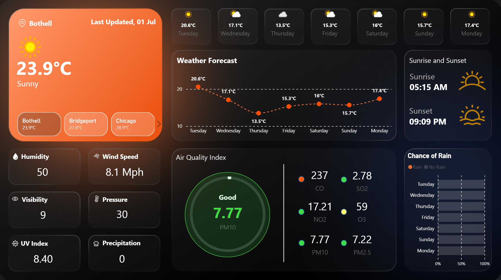

# 🌦️ Weather App: Real-Time Weather & Air Quality Dashboard

### A sleek, interactive Power BI dashboard to monitor real-time weather, weekly forecasts, and air quality across major U.S. cities, all in one view.

---

## 1.  Purpose  
WeatherScope is a modern Power BI dashboard designed to give users a complete, real-time snapshot of weather conditions, 7-day forecasts, and air quality data for multiple cities. It’s built for anyone needing fast, visual insights into atmospheric health—commuters, analysts, or just curious minds.

---

## 2. Tech Stack  
Built with the following tools and technologies:  
• 📊 **Power BI Desktop** – Core visualization platform  
• 🔄 **Power Query** – Used to parse, clean, and reshape nested JSON API data  
• 🧠 **DAX** – Used for calculations, conditional visuals, and dynamic insights  
• 🌐 **WeatherAPI.com** – Source of real-time weather and air quality data  
• 🗂️ **Data Modeling** – Structured tables for location, current conditions, forecast, and hourly air quality  
• 📁 **File Format** – `.pbix` for development and `.png` for dashboard previews

---

## 3. Data Source  
**Source**: [WeatherAPI.com](https://www.weatherapi.com)  
The data is pulled directly via JSON endpoints and includes:  
- **Location Metadata**: city, state, country, timezone  
- **Current Conditions**: temperature, wind speed, humidity, visibility, pressure, UV index, precipitation  
- **Forecast Data**: 7-day temperature trends, chance of rain, sunrise/sunset, and daily summaries  
- **Air Quality**: PM2.5, PM10, CO, NO₂, SO₂, O₃, and US/EU AQI indexes  
Tables are separated for `Current`, `Forecast`, and `Location`, with measures flattened and typed in Power Query.

---

## 4. Features / Highlights  

### • Business Problem  
Real-time weather and pollution data are often scattered, text-heavy, or inaccessible to the average person.  
The challenge is making this data easy to interact with, explore, and understand in a glance.

Key questions:  
- What’s the weather today in multiple cities?  
- How will conditions change over the next 7 days?  
- Is the air quality safe in my city right now?  
- Should I plan for rain or sunshine this weekend?

---

### • Goal of the Dashboard  
To provide a clean, intuitive dashboard where users can:  
- View current and forecasted weather for multiple cities  
- Track environmental air quality trends in real-time  
- Get fast insights into humidity, pressure, wind, and UV indexes  
- Make informed decisions about travel, health, and daily planning

---

### • Walkthrough of Key Visuals  

- 🔸 **Main Weather Card (Top Left)**  
  Shows current temperature, condition, and last updated time  
  Includes quick toggles for Bothell, Bridgeport, and Chicago  

- 🔘 **Date Slicer & Line Chart (Top Center)**  
  A day-of-week button slicer controls a temperature trend line showing 7-day highs/lows  

- 🌅 **Sunrise & Sunset Panel (Top Right)**  
  Cards showing today’s sunrise and sunset times with matching icons  

- 💧 **Current Conditions Cards (Bottom Left)**  
  Humidity, wind speed, visibility, pressure, UV index, and precipitation, all color-themed  

- 🌫️ **Air Quality Index (Center Bottom)**  
  Circular gauge for PM10 score  
  Metrics for CO, NO₂, SO₂, O₃, PM2.5 — with color-coded risk indicators  

- 🌧️ **Chance of Rain by Day (Bottom Right)**  
  A stacked bar chart showing rain probabilities throughout the week

---

### • Business Impact & Insights  
- **Public Awareness**: End-users can assess health risks from poor air quality  
- **Travel Planning**: Plan trips or commutes based on UV levels, precipitation, or visibility  
- **Data Exploration**: Demonstrates how real-time APIs can drive live dashboards  
- **Smart Forecasting**: Combines forecast and air data to spot patterns and anomalies  

---

## 5. Screenshot / Demo  
  
> Full Power BI report with city selection, dynamic visuals, and color-coded risk metrics.
>
> [▶️ Watch Demo Video](./Weather_App_Demo-Video.mp4)

